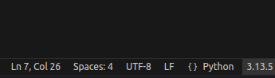
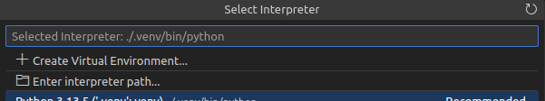

# Ну это короче типо шаблон для проекта по БД
Юзаем мы Flask и SqlAlchemy.
## Установка
Для начала нужно вообще питон поставить, но это я думаю разберешься.

### Ну короче про юзание виртуальных окружений.
Ставим python в vscode, открываем папку с проектом. <br>
На нижней панели будет надпись "python такой-то", ну либо предложение выбрать версию питона, либо че-то похожее:

Либо вскод сам предложит выбрать версию питона и создать виртуальное окружение. Если предложит, соглашаемся, если нет - нажимаем на нижней панели на ту самую надпись и выбираем "Create Virual Environment":

ВСкод сам все создаст, париться не надо. <br>
Потом в папке проекта появится каталог ".venv". <br>
Если был запущен терминал, нужно его закрыть и открыть заново, чтобы активировалось виртуальное окружение. <br>
Дальше выполняем команду:
```
pip install --upgrade sqlalchemy flask
```
Сервак мы будем не через фласк запускать а через другую херь специально для серваков:
```
pip install waitress
```
Сервер будет так запускаться в итоге(production_server):
```
waitress-serve --call '<каталог с .py приложений, в котором есть __init__py>:<функция,с которой начинается запуск сервера(в примере сreate_app)>'
```
Для разработки лучше(dev-сервер):
```
flask -A <каталог с .py приложений, в котором есть __init__py> run --debug
```
Потом открываешь в браузере [localhost:5000](localhost:5000) (dev) или [localhost:8080](localhost:8080) (production)
## Начало
Сделал тестовый пример с оф сайта, буду пытаться подружить его с sqlalchemy <br>
Я точно буду делать БД, нужно фронтенд написать и еще там какую нибудь херь. <br>

[Учебник со всем про все по Flask-у](https://flask.palletsprojects.com/en/stable/)

### Инфо про содержимое
В папке test находится тестовый кусок, чтобы я просто фласку учился. <br>
В real - обычный шаблон. <br>
.gitignore это файлик для того чтобы git не загружал всякую лишнюю херню по типу кэша vscode-овского питона. <br>
LICENSE это короче лицензия проекта, по приколу ее включил. <br>
README.md это реадми, то что вот щас ты смотришь.
